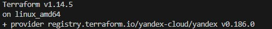
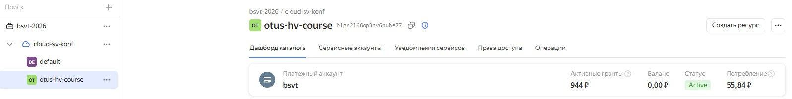
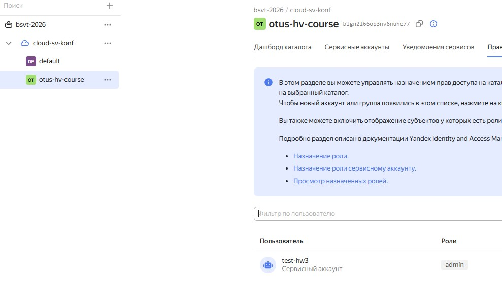
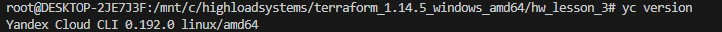
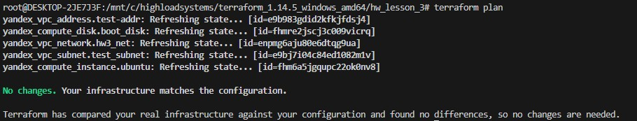
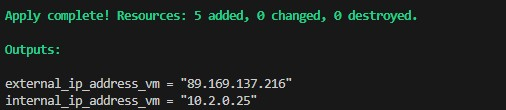
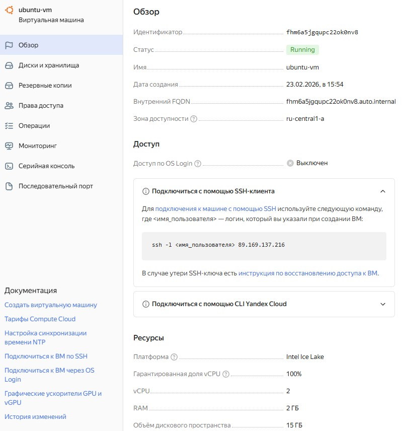
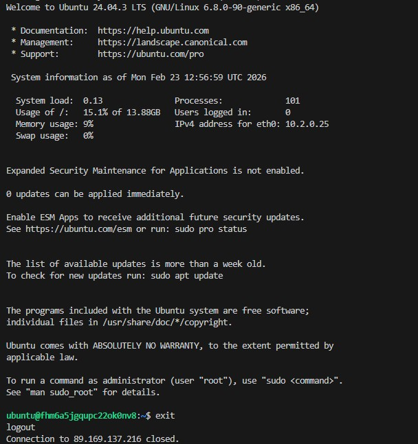

## Описание проекта
Домашнее задание №1 урока 3 по курсу Инфраструктура высоконагруженных систем от OTUS. 
Цель работы: 
- cоздать и запустить базовый Terraform скрипт для автоматизации установки и настройки виртуальной машины в рабочем окружении;
- получить базовые навыки работы с Terraform для создания и управления инфраструктурой;
- понять принципы IaC (Infrastructure as Code) и научиться применять их для автоматизации инфраструктуры;

Описание выполнения домашнего задания в соответствии с пошаговой инструкцией:
1) Подготовка окружения:
Установка Terraform на локальный ПК, выполнение terraform init. Проверка, что Terraform установлен на локальной машине:

Создание УЗ, платежного аккаунта, облака и каталога в Yandex Cloud:

Создание сервисного аккаунта

Установить командной строки Yandex Cloud. 

Настройка доступа к облачному провайдеру: в создание main.tf, providers.tf и variables.tf. Создание сети, подсети и ресурса (виртуальная машина ubuntu) в main.tf. Добавление output.tf, которая покажет IP-адреса созданной виртуальной машины. 
4) Инициализация и запуск:
Запустить terraform init, проверка формата кода terraform fmt, проверить корректность кода terraform validate, составить план terraform plan.

В данном случае все изменения уже применены

Запустить terraform apply, чтобы создать виртуальную машину.

5) Проверка результата:
Убедиться, что виртуальная машина создана и ее IP-адрес получен.

Подключиться к машине по SSH для подтверждения ее доступности.

Домашнее задание выполнено с использованием ресурсов:

https://yandex.cloud/ru/docs/tutorials/infrastructure-management/terraform-quickstart
https://yandex.cloud/ru/docs/cli/quickstart#install
https://yandex.cloud/ru/docs/compute/operations/vm-connect/ssh#linux-macos_2

https://registry.terraform.io/providers/yandex-cloud/yandex/latest/docs/resources/compute_instance
https://www.youtube.com/watch?v=q12v5mbMnco&list=PLjobQbACcMNlYIU0uYKM7GscG9g5Y3_bq&index=2

Файл с ключами `key.json` не включен в репозиторий по соображениям безопасности.

