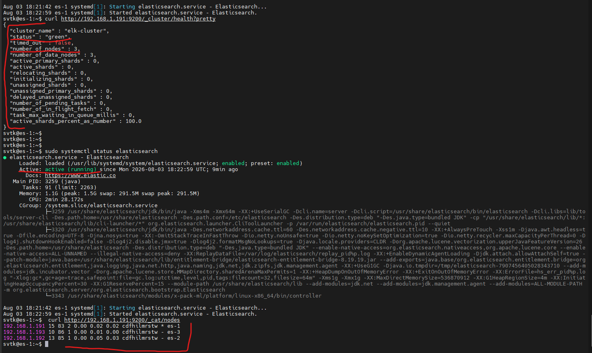
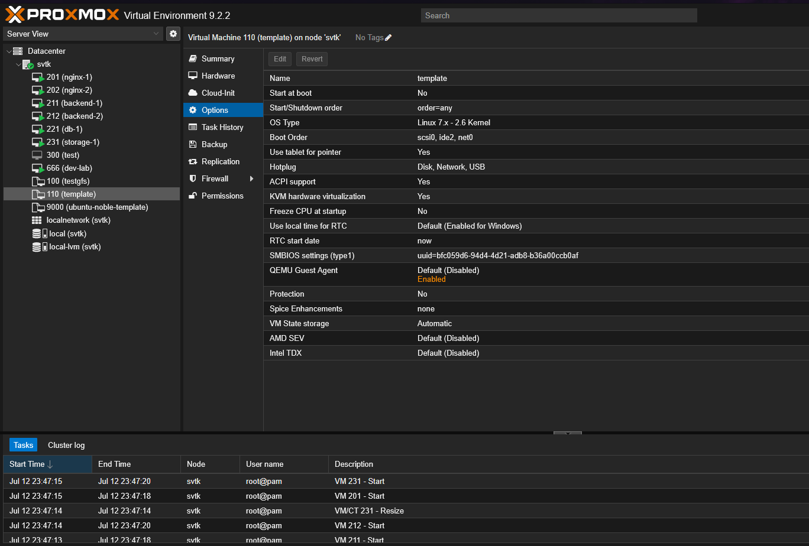
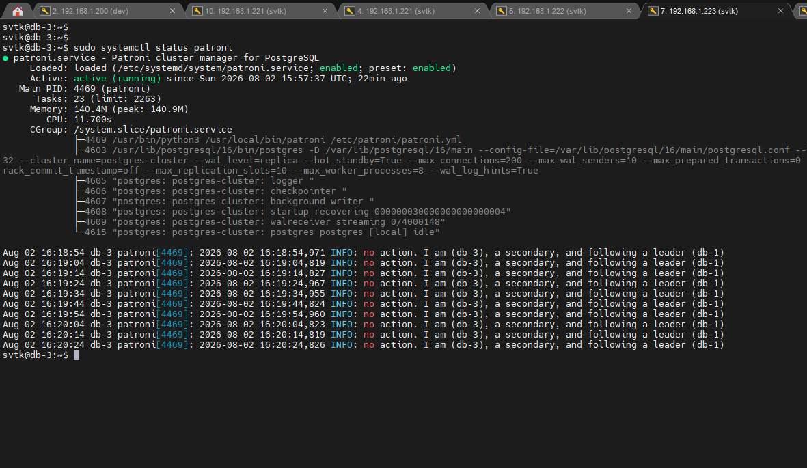
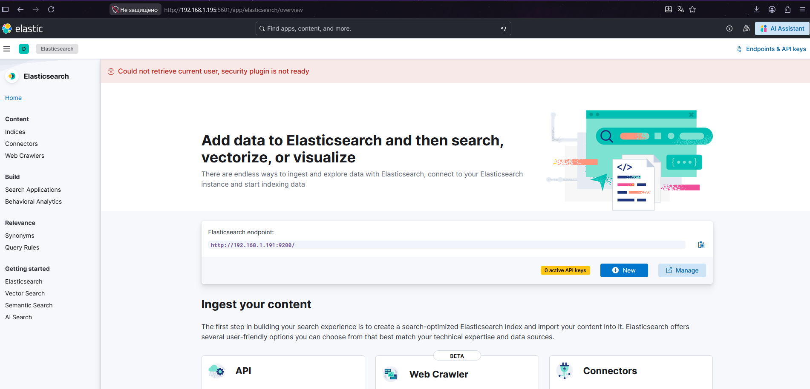
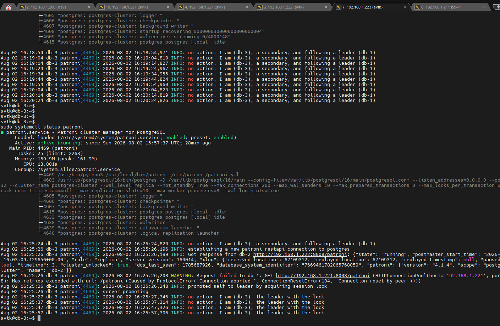
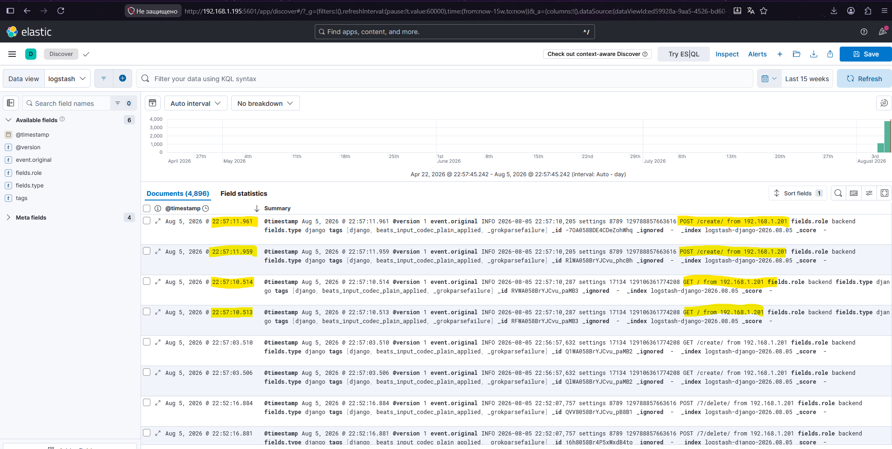

Описание проекта

Домашнее задание №7 урока 14 по курсу Инфраструктура высоконагруженных систем от OTUS. 
Цель работы: 
 - развернуть отказоустойчивый кластер Elasticsearch для хранения логов;
 - организовать централизованный сбор логов со всех серверов проекта;
 - обеспечить визуализацию и поиск логов через Kibana для мониторинга и диагностики.

Описание/Пошаговая инструкция выполнения домашнего задания:

Используем terraform и ansible роль для развертывания отказоустойчивого кластера Elasticsearch, Logstash, Kibana, Filebeat. 

Разворачиваем отказоустойчивый кластер Elasticsearch, Logstash и Kibana в Proxmox, также доустанавливаем агент для сбора логов Filebeat на backend и frontend ноды.

Подготовленная инфраструктура
В лабораторной работе развернуты 2 nginx с балансировкой через VIP Keepalived + 2 backend + 3 ВМ БД PostgreSQL + 3 ВМ Elasticsearch кластер, + ВМ Logstash, + ВМ Kibana.
- nginx-1 — первый nginx-хост;
- nginx-2 — второй nginx-хост;
- backend-1 — первый backend-хост с Django-приложением;
- backend-2 — второй backend-хост с Django-приложением;
- db-1, db-2, db-3 — три узла PostgreSQL (Patroni, etcd);
- es-1, es-2. es-3 - три узла Elasticsearch;
- ls-1 - ВМ Logstash (обработка и пересылка логов);
- kibana-1 - ВМ Kibana (визуализация)

1. Подготовка инфраструктуры (Terraform):
 - добавляем 5 ВМ - три elasticsearch, 1 logstash и 1 kibana;
2. Установка и настройка кластера Elasticsearch c помощью Ansible роли elasticsearch:
 - Установка Elasticsearch с зеркала Яндекс; 
 - Настройка конфигурации elasticsearch.yml;
3. Установка и настройка Logstash:
 - Установка Logstash с зеркала Яндекс;
 - Настройка конфигурации logstash.conf.j2 - принимаем логи от Filebeat, филтруем их и отправляем в ES;
4. Установка и настройка Kibana.
 - Установка Kibana с зеркала Яндекс;
 - Настройка конфигурации Kibana с указанием хостов Elasticsearch;
5. Установка и настройка Filebeat на бэкенд и фронтенд хосты.
 - Установка Filebeat с зеркала Яндекс на экенд и фронтенд хосты;
 - Установка Настройка конфигурации Filebeat на хотсах для сбора логов и отправки на Logstash;
   
На скриншоте 1 видим что кластер Elk из трех нод создан, готов к работе. Видим что es-1 является мастером. 

На скриншоте 2 видим что Logstash готов к работе

На скриншотах 3 и 4 видим что Kibana готов к работе и веб интерфейс поднялся

На скриншотах 5 и 6 видим что в результате добавления заметок в приложении, логи появляются в kibana - от фронтенд хоста поступают запросы GET и POST

