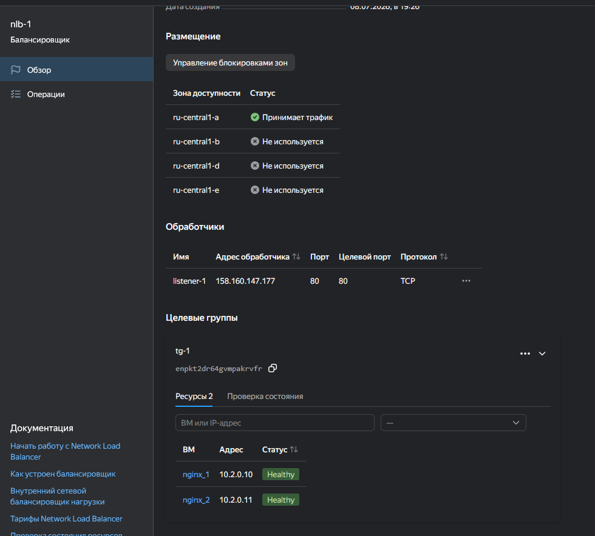
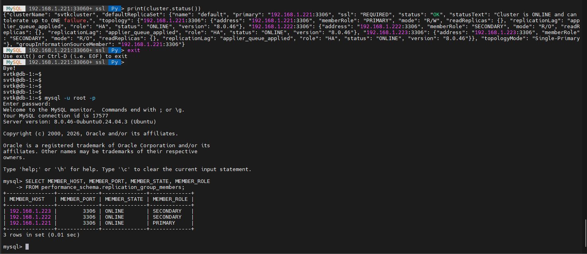

## Описание проекта
Домашнее задание №5 урока 11 по курсу Инфраструктура высоконагруженных систем от OTUS. 
Цель работы: 
Перевести базу веб-проекта на один из вариантов кластера MySQL: Percona XtraDB Cluster или InnoDB Cluster.

## Описание/Пошаговая инструкция выполнения домашнего задания:

Используем terraform и ansible роль для развертывания отказоустойчивого кластера MySQL. В проекте выбран InnoDB Cluster.

1) Разворачиваем отказоустойчивый кластер MySQL (InnoDB Cluster) на ВМ в Proxmox.
2) Создаем внутри кластера БД для проекта.

## Подготовленная инфраструктура

В лабораторной работе развернуты 2 nginx с балансировкой через VIP Keepalived + 2 backend + 3 ВМ БД Mysql

- nginx-1 — первый nginx-хост;
- nginx-2 — второй nginx-хост;
- backend-1 — первый backend-хост с Django-приложением;
- backend-2 — второй backend-хост с Django-приложением;
- db-1, db-2, db-3 — три узла MySQL InnoDB Cluster с автоматическим переключением при сбоях.

InnoDB Cluster состоит из трёх узлов (db-1, db-2, db-3), использующих групповую репликацию. При отказе одного из узлов кластер продолжает работу, автоматически выбирая нового PRIMARY.

## Ход работы

1. Развёртывание MySQL InnoDB Cluster (роль db)

    Роль назначается на группу db (db-1, db-2, db-3).
    Устанавливается MySQL 8.0, MySQL Shell, Python-коннектор.
    Настраивается bind-address = 0.0.0.0 и удаляются все конфликтующие конфиги.
    Устанавливается плагин group_replication.
    Создаётся административный пользователь cluster_admin с полными правами.
    На db-1 создаётся InnoDB Cluster с использованием communicationStack: XCOM и указанием локального адреса и порта (33061).
    Вторичные узлы (db-2, db-3) добавляются в кластер через clone-восстановление.
    Также в роли создаются база данных app_db и пользователь app для Django-приложения.

2. Настройка MySQL Router (роль mysql_router)

    Роль назначается на группу backend (backend-1, backend-2).
    Устанавливается MySQL Router.
    Выполняется bootstrap-команда с использованием административного пользователя cluster_admin. Router настраивается на локальный порт (127.0.0.1) с портами 6446 (RW) и 6447 (RO).
    После bootstrap Router запускается как systemd-сервис.

3. Развёртывание Django-приложения (роль backend_app)

    На бэкенд-серверах устанавливаются Python, виртуальное окружение и зависимости.
    Синхронизируется исходный код приложения (из локальной папки).
    Создаётся файл .env с параметрами подключения к базе через MySQL Router (host=127.0.0.1, port=6446 для записи, 6447 для чтения — Django использует RW порт для миграций и записи).
    Запускается миграция (выполняется один раз через delegate_to на backend-1).
    Собираются статические файлы в общую директорию GFS2.
    Настраивается Gunicorn как systemd-сервис.

На скриншоте видим что при остановке узла db-2 приложение работает

Видим, что при вводе команды print (cluster.status()) отображается PRIMARY DB-1 192.168.1.221 и 2 SECONDARY DB-2,3 192.168.1.222 и 192.168.1.223

